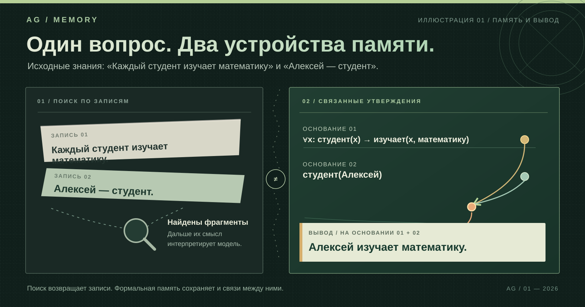

# AG Memory

**Долговременная память для языковых агентов, в которой сохраняются не только сообщения, но и знания, связи между ними и основания выводов.**

### Один вопрос, которого не было в переписке

Агенту сообщили два утверждения:

**01** — «Каждый студент изучает математику».

**02** — «Алексей — студент».

Позже его спрашивают: **«Алексей изучает математику?»**

Готового ответа в исходных сообщениях нет. Но из двух утверждений он следует: если правило относится ко всем студентам, а Алексей — студент, то правило относится и к нему. В АГ-памяти такие утверждения представлены как связанные семантические конструкции. Система может не только вспомнить исходные сведения, но и получить вывод с указанием его оснований — при условии, что необходимые знания корректно формализованы и остаются действующими.

*Иллюстрация сопоставляет АГ-память с простым поиском по сохранённым текстовым фрагментам. Это два принципа организации знаний, а не оценка всех существующих систем долговременной памяти.*

[**Как устроено**](#как-это-устроено) · [**Запуск**](#запуск) · [**Техническая архитектура**](#архитектура) · [**Документация**](#документация)

---

## Как это устроено

AG Memory — ассоциативно-гетерархическая память: знания представлены в виде связанной структуры, а не только в виде последовательности сообщений. Она объединяет несколько механизмов, каждый со своей задачей.

| Механизм | Для чего нужен |
|---|---|
| **Формализация** | Превращает естественный язык в типизированные сущности, отношения, события и логические конструкции. |
| **Каноническая память** | Связывает новые наблюдения с существующими знаниями, сохраняя их происхождение. |
| **Ассоциативное вспоминание** | Поднимает в текущий фокус связанные и релевантные элементы памяти. |
| **Символический вывод** | Получает следствия из формализованных утверждений по допустимым правилам. |
| **Версии и основания** | Позволяют уточнять трактовку, отзывать опоры и сохранять историю изменений. |

Важно различать **вспоминание** и **вывод**. Первое отвечает на вопрос «что сейчас относится к запросу?», второе — «что действительно следует из доступных утверждений?». Ассоциативная близость сама по себе не считается доказательством.

Один ход агента в упрощённом виде:

~~~text
сообщение → формализатор → АГ-память
                               ↓
                    активация и вспоминание
                               ↓
                      символический вывод
                               ↓
                      контекст агента
                               ↓
                       агентская LLM
                               ↓
                       ответ / действие
~~~

Здесь действуют **две разные роли языковой модели**. LLM-парсер вызывается формализатором только для разрешённых локальных задач разбора текста. Агентская LLM получает подготовленный контекст и формирует ответ или действие. Даже если используется одна физическая модель, её вызовы, входы и полномочия в этих ролях различаются.

---

## Запуск

Проект рассчитан на локальную среду выполнения. Требуются **Python 3.12 или новее**, `uv` и доступ к языковой модели через Ollama, LM Studio либо встроенный процесс Hugging Face/PyTorch.

### 1. Установить проект

~~~bash
git clone --branch temp https://github.com/MaxSquizie/AG_Memory.git
cd AG_Memory
uv venv
~~~

Активировать окружение:

~~~powershell
# Windows
.venv\Scripts\activate
~~~

~~~bash
# Linux / macOS
source .venv/bin/activate
~~~

Установить графический интерфейс:

~~~bash
uv pip install -e ".[gui]"
~~~

Для встроенного процесса Hugging Face/PyTorch вместо этого используется `uv pip install -e ".[gui,llm]"`.

### 2. Подготовить модель

Например, для Ollama:

~~~bash
ollama pull qwen2.5:7b
ollama serve
~~~

Профиль подключения: `config/ollama.toml`. Для LM Studio предусмотрен `config/lmstudio.toml`, для встроенного процесса — `config/default.toml`.

### 3. Подготовить ресурсы формализатора V7

**V7 не запускается на выдуманном или неутверждённом словаре.** Перед запуском необходимы реальный ресурсный релиз `formalizer_release.json`, отчёт о его покрытии, подтверждение проверяющего и файл `formalizer_reviews.json` с доверенными ключами и записями проверки. Ссылки `TemplateMap.template_ref` должны указывать на существующие шаблоны `T` в загружаемой АГ-памяти.

Проверьте релиз и затем запустите интерфейс:

~~~bash
python -m ah.formalizer.resources.release_cli check data/formalizer_release.json --trusted-reviews data/formalizer_reviews.json --ah-snapshot data/memory.json
ah-gui --config config/ollama.toml
~~~

Пути необходимо согласовать с конфигурацией. Если ресурсы отсутствуют, подпись недоверенная или ссылки на `T` некорректны, запуск останавливается. Отдельный флаг для подключения V7 не требуется.

---

## Архитектура

### 1. Память: что именно хранится

Состояние АГ-памяти обозначается как `AH = <S, C, P, H, L>`.

| Область | Содержание |
|---|---|
| `S` | языковые символы и словоформы |
| `C` | устойчивые канонические знания |
| `P` | пропозициональные конструкции и результаты рассуждений |
| `H` | опыт агента: сообщения, события, эпизоды |
| `L` | направленные типизированные связи |

Базовые типы элементов имеют разное назначение: `s` — языковой символ, `m` — сущность или понятие, `T` — шаблон предиката с ролями, `N` — конкретная реализация предиката, `g` — логическая или функциональная конструкция, `k` — группировка либо набор альтернатив, `L` — связь.

Например, в предложении «Иван передал книгу Марии» память различает участников, тип отношения «передать» и конкретное событие передачи. Для него важны не только слова, но и роли: **кто передал**, **что передал** и **кому**. Отрицание, кванторы и другие логические конструкции также имеют собственную структуру.

### 2. Формализатор: как текст становится структурой

Нормативная архитектура формализатора — **V7**. Её задача — построить структурные варианты интерпретации, проверить ограничения и основания, а затем сформировать допустимую операцию записи. Неоднозначность не заменяется произвольным наиболее похожим смыслом.

Ключевая последовательность стадий:

~~~text
RawInput → T0 → SRL → T1 → TD → T2 → TP
         → structural_seal → T3 → T4
         → assemble_candidate_ir → C → T5 → T6

T6b: новая версия интерпретации и отзыв опор
~~~

Названия сохранены без перевода, поскольку это идентификаторы архитектуры и кода.

<b>Назначение каждой стадии формализатора</b>

| Стадия | Назначение |
|---|---|
| `T0` | Проверка входа и сохранение исходных текстовых диапазонов без потерь. |
| `SRL → T1 → TD` | Лексический, морфологический, синтаксический разбор; кореференция и область действия. |
| `T2` | Построение предикативных рамок с типизированными аргументами. |
| `TP` | Ограниченная локальная гипотеза при обнаруженном структурном разрыве. |
| `structural_seal` | Фиксация структуры текущей версии. |
| `T3` | Разрешение значений в уже определённых структурных позициях. |
| `T4` | Согласование совместимых вариантов или сохранение неопределённости. |
| `assemble_candidate_ir` | Сборка неизменяемого промежуточного представления `FormalizerCandidateIR`. |
| `C` | Установление канонической идентичности, устранение дубликатов, план привязки. |
| `T5` | Фиксация решений и плана в устойчивом журнале. |
| `T6` | Атомарное применение допустимого плана к памяти. |
| `T6b` | Пересмотр интерпретации и отзыв устаревших опор через новую версию. |

**LLM-парсер** внутри этого контура вправе предложить локальную структурную гипотезу либо выбрать из явно разрешённых вариантов. Его результат проверяется детерминированными механизмами. Он не назначает канонические идентификаторы, не объявляет содержание истинным и не записывает данные напрямую в АГ-память.

**Агентская LLM** не является частью этого парсера. Она работает с контекстом, подготовленным памятью, и генерирует ответ. Текст её ответа не превращается автоматически в канонический факт.

### 3. Основания: почему утверждение допустимо

Формализатор разделяет **основания утверждения** и **основания интерпретации**.

Основания `O`, `C`, `W` связаны с самим утверждением: наблюдением, явно заданным контекстом или версионированным фоновым знанием. Они могут поддерживать запись утверждённого содержания.

Основания `R`, `D`, `M`, `A`, `P` поясняют, *почему текст был разобран определённым образом*: по ресурсу, правилу, проверенному предложению парсера, объявленной гипотезе либо предшествующему наблюдению. Сами по себе они не подтверждают истинность содержания.

Это не позволяет подменить основание факта удачно распознанной грамматической конструкцией.

### 4. Логика, новая лексика и время

- **Логика.** Конструкции `AND`, `OR`, `XOR`, `NOT`, `IMPLIES`, `FORALL`, `EXISTS` и модальные либо временные операторы представлены структурно. `FunctionRegistry` определяет сигнатуры и допустимые правила вывода.
- **Неизвестные слова.** Если структура высказывания понятна, но смысл предиката ещё не подтверждён, формализатор может создать локальный открытый предикат `OpenPredicateCandidate` со статусом `UNLINKED`. Он не получает семантику другого предиката по одному лишь сходству.
- **Время.** `TemporalLedger` связывает временные сведения с конкретными записями поддержки, чтобы отзыв одного свидетельства не уничтожал другие независимые основания.

### 5. Версии и отзыв

АГ-память хранит происхождение знаний и историю их интерпретаций. Для этого используются записи наблюдений, версии интерпретации, `SupportRecord`, `IdentityBinding`, `UsageLink` и `NodeLifecycleEvent`.

Один канонический факт может поддерживаться несколькими независимыми источниками. Если наблюдение отозвано, становятся неактивными зависимые от него опоры — но не вся история и не обязательно сам узел. При наличии другой действующей опоры знание остаётся доступным.

### 6. Ассоциативное вспоминание и рабочее пространство

Стимул возбуждает связанные элементы графа. Механизм активации распространяет это возбуждение; активное подмножество памяти образует текущее **рабочее пространство** агента. Из него строится контекст для агентской модели.

При этом **высокая активация не делает утверждение истинным**. Релевантность определяется ассоциативным контуром, логическое следование — правилами вывода и действующими основаниями.

---

## Командная строка и встраивание

После установки доступны `ah-gui` (графический интерфейс) и `ah-agent` (интерфейс командной строки).

~~~bash
ah-agent --config config/ollama.toml summary
ah-agent --config config/ollama.toml dump-json
ah-agent --config config/ollama.toml dump-dot
ah-agent --config config/ollama.toml import-text notes.txt
ah-agent --config config/ollama.toml native-sources
ah-agent --config config/ollama.toml native-clarifications
~~~

<b>Операции пересмотра и отзыва V7</b>

~~~bash
ah-agent --config config/ollama.toml retract-observation observation:ID 1 --trigger withdrawal:ID
ah-agent --config config/ollama.toml retract-time-assertion assertion:ID --trigger withdrawal:ID
ah-agent --config config/ollama.toml retract-support support:ID --trigger withdrawal:ID
ah-agent --config config/ollama.toml reinterpret-observation observation:ID 1 --trigger revision:ID --input-changes changes.json
ah-agent --config config/ollama.toml migration-plan sources.json --trigger release:ID
ah-agent --config config/ollama.toml migration-resume migration:HASH
ah-agent --config config/ollama.toml native-clarify 'v7:REQUEST_HASH:OPTION_HASH'
~~~

Идентификаторы выбираются по данным `native-sources` и `native-clarifications`. Файл `changes.json` содержит изменения входных условий, а `sources.json` — перечень наблюдений для переноса между ресурсными версиями.

История АГ-памяти состоит из согласованных снимка и журнала `formalizer_journal.log`. При подключённом писателе V7 команды `import-memory` и `reset-memory` не допускаются: они могли бы нарушить согласованность истории. Новая память создаётся в отдельном каталоге данных с собственным каталогом `T` и утверждённым ресурсным релизом.

Пример встраивания в Python:

~~~python
from ah.config import AppConfig
from ah.bootstrap import RuntimeServices

config = AppConfig.from_toml("config/ollama.toml")
services = RuntimeServices.build(config)

result = services.agent.handle_user_text("Иван передал книгу Марии.")
~~~

---

## Структура репозитория

~~~text
AG_Memory/
├── config/                настройки среды выполнения и моделей
├── data/                  данные и примеры структур
├── docs/                  архитектура и документация
├── src/
│   ├── ah/
│   │   ├── agent/         цикл агента
│   │   ├── core/          ядро АГ-памяти
│   │   ├── formalizer/    формализатор V7
│   │   ├── ignition/      ассоциативная активация
│   │   ├── inference/     символический вывод
│   │   ├── projection/    подготовка контекста агента
│   │   └── gui/           графический интерфейс
│   └── rag/               вспомогательный пакет
└── pyproject.toml
~~~

## Документация

- [Архитектура формализатора V7](docs/FORMALIZER_ARCHITECTURE_V7.md) — полные стадии, данные, основания, версии, логика и границы записи.
- [Архитектура АГ-памяти](docs/reference/Архитектура_v3.md) — концепция когнитивного цикла и организации памяти.
- [Карта реализации V7](docs/IMPLEMENTATION_MAP_V7.md) — соответствие архитектуры модулям исходного кода.
- [Запуск и настройка](docs/RUN.md) — параметры окружения и практическая эксплуатация.
