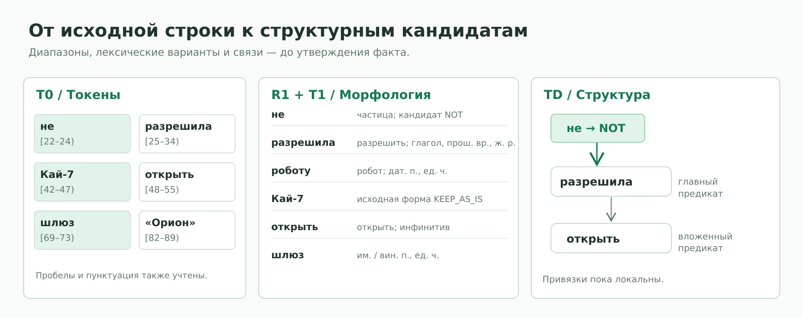
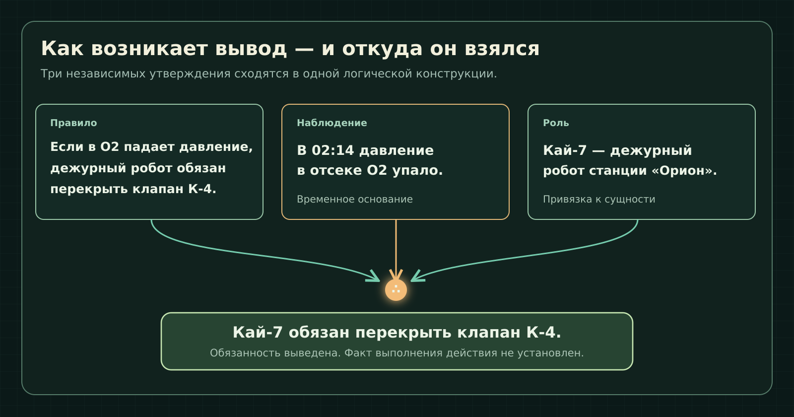
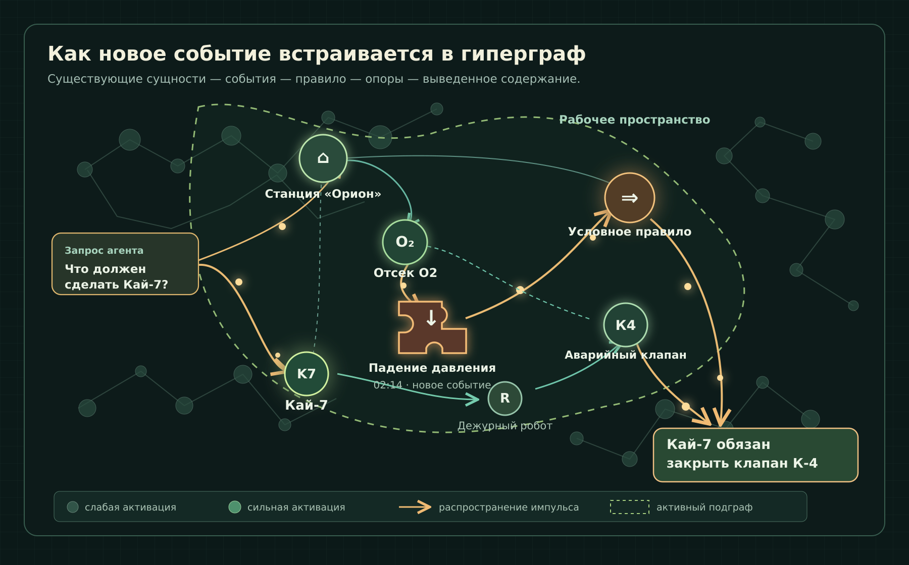

# AG Memory

**Долговременная память для языкового агента. Не архив диалогов, а связанная система сущностей, событий, отношений и оснований, из которых можно вспоминать и делать выводы.**

Представьте агента, работающего с журналом космической станции. В памяти уже есть сведения об оборудовании, экипаже и регламенте. Поступает новое сообщение: **в кислородном отсеке упало давление**. Теперь агенту нужно не просто найти это сообщение — ему нужно связать его с правилом, установить ответственного, определить требуемое действие и объяснить, откуда взялся ответ.

Ниже один пример последовательно проходит через архитектуру AG Memory. Схемы показывают **принцип представления**, а промежуточные записи намеренно упрощены: это не выдача запущенного формализатора и не утверждение о готовности конкретного ресурсного набора.

[**Исходные сведения**](#исходные-сведения) · [**Формализация**](#от-фразы-к-смысловой-структуре) · [**Память и вывод**](#сборка-знания-в-памяти) · [**Гиперграф**](#гиперграф-в-действии) · [**Установка**](#установка-и-запуск)

---

## Исходные сведения

В систему поступают сообщения из разных источников. Они относятся к одной станции, но приходят раздельно.

> **Справочник оборудования:** На станции «Орион» есть кислородный отсек О2. Его аварийный клапан — К-4.
>
> **Назначение смены:** Кай-7 — дежурный робот станции «Орион».
>
> **Регламент:** Если в кислородном отсеке О2 падает давление, дежурный робот станции обязан перекрыть клапан К-4.
>
> **Наблюдение:** В 02:14 давление в отсеке О2 станции «Орион» упало.

Позже агент получает вопрос:

**Что должен сделать Кай-7 и почему?**

Ответ здесь не содержится готовой фразой. Чтобы получить его, нужно совместить конкретное событие, условное правило, назначение дежурного и принадлежность клапана отсеку. При этом **обязанность закрыть клапан не равна факту, что он уже закрыт**.

Такой случай задействует сразу несколько сторон памяти: распознавание естественного языка, каноническую идентичность объектов, логику условия, временную привязку, доказательные основания, ассоциативную активацию и последующее изменение знаний.

## От фразы к смысловой структуре

### Исходный текст остаётся источником

Формализатор принимает текст и версионированные ресурсы. На стадии `T0` он сохраняет исходную запись, её текстовые диапазоны и сведения о происхождении. Это важно: дальше структура может уточняться, но всегда должно быть понятно, **какой фрагмент первоначально послужил основанием**.

Рассмотрим наблюдение:

~~~text
«В 02:14 давление в отсеке О2 станции „Орион“ упало».
~~~

Для человека здесь очевидны событие, место и время. Машине недостаточно сохранить эти слова рядом. Нужно установить, какая часть фразы какую роль выполняет.

### Сначала структура предложения, потом значения

Стадии `SRL → T1 → TD → T2` строят и согласуют лексические, морфологические, синтаксические и структурные варианты: где предикат, какие у него аргументы, какие слова относятся к одному объекту, где границы области действия условия или отрицания.

Промежуточный смысловой набросок для наблюдения:

~~~text
Событие:       падение давления
Участник:      давление
Место:         кислородный отсек О2
Принадлежность: станция «Орион»
Время:         02:14
Источник:      исходное наблюдение
~~~

Это ещё **не записанный факт**. Пока существуют лишь варианты интерпретации исходного текста и связи с его диапазонами.

### Условие нельзя потерять при разборе

Точно так же обрабатывается регламент:

> Если в отсеке О2 падает давление, дежурный робот станции обязан перекрыть клапан К-4.

Это не два независимых утверждения «давление падает» и «робот перекрывает клапан». Это **условная конструкция**: вторая часть зависит от первой.

Её упрощённый смысловой вид:

~~~text
ЕСЛИ   падение_давления(отсек=О2)
ТО     обязан_перекрыть(дежурный_робот(«Орион»), клапан=К-4)
~~~

Здесь `ЕСЛИ → ТО` обозначает логическую связь. `обязан_перекрыть` — условное имя содержательного предиката примера, а не обещание, что в программе существует оператор с таким названием. В реальной памяти предикат должен опираться на разрешённые шаблоны и правила вывода.

Тот же принцип относится к отрицанию, кванторам, модальности и времени: область действия не должна превращаться в случайную текстовую пометку.

### Где участвует LLM-парсер

Если детерминированного разбора и разрешённых ресурсов недостаточно, стадия `TP` допускает **ограниченную структурную гипотезу**. После `structural_seal` структура текущей версии фиксируется; `T3` разрешает значения в уже существующих позициях, `T4` согласует допустимые варианты либо сохраняет неопределённость.

LLM-парсер здесь — вспомогательный компонент **формализатора**, а не агентская языковая модель, отвечающая пользователю. Он может предложить локальную гипотезу или выбрать из разрешённых вариантов. Он не назначает канонические идентификаторы, не устанавливает истинность и не записывает содержание напрямую в память. Даже если обе роли обслуживает одна физическая модель, их контракты остаются разными.

Если значение нового предиката пока не подтверждено, архитектура допускает открытое лексическое представление со статусом `UNLINKED`. Это позволяет сохранить содержание с ограниченными правами вывода, не приписывая неизвестному слову смысл уже знакомого.

## Сборка знания в памяти

### Новое наблюдение должно найти своё место

Формализатор передаёт типизированное представление на каноническую привязку `C`, затем решения фиксируются стадией `T5`, а допустимые изменения атомарно применяются стадией `T6`.

Ключевой момент: **станция «Орион», отсек О2 и робот Кай-7 не создаются заново при каждом упоминании**. Если их идентичность установлена, новые наблюдения связываются с уже существующими сущностями.

Для этого AG Memory использует несколько разных видов элементов:

| Элемент | Что представляет в нашем примере |
|---|---|
| `s` | Языковые обозначения и формы слов: «отсек», «О2», «упало». |
| `m` | Сущности: «Орион», О2, К-4, Кай-7. |
| `T` | Шаблоны отношений и событий с типизированными ролями. |
| `N` | Конкретные предикативные конструкции: «Кай-7 дежурит», «давление упало». |
| `g` | Функциональные и логические конструкции, в том числе условие. |
| `k` | Группировки и адресуемые наборы. |
| `L` | Направленные связи между элементами. |

Их организация задаётся как `AH = <S, C, P, H, L>`: языковые символы, канонические знания, пропозициональный контур, история пережитого опыта и типизированные связи.

Таким образом, новое событие **не ложится в память отдельным текстовым островком**. Оно присоединяется к отсеку О2, его станции, известному правилу и связанным объектам. Часть структуры существовала до сообщения о падении давления; сообщение добавляет новые элементы и основания.

### Как память различает происхождение и истину

Разбор текста и подтверждение его содержания — разные операции.

**Основания факта** `O / C / W` могут поддерживать утверждаемое содержание: исходное наблюдение, явно объявленный контекст или версионированное фоновое знание.

**Основания интерпретации** `R / D / M / A / P` показывают, почему текст разобран именно так: с помощью ресурсов, правил, проверенного предложения LLM-парсера, внешней гипотезы либо предыдущего наблюдения. Но хорошая интерпретация **сама по себе не доказывает, что событие произошло**.

В примере сообщение о падении давления даёт основание утверждения; грамматическое правило, которое распознало «в отсеке О2» как указание места, даёт лишь основание интерпретации.

### Как получается ответ

Теперь у системы есть три смысловых фрагмента:

~~~text
ПРАВИЛО
падение_давления(О2) ⇒ обязан_перекрыть(дежурный_Ориона, К-4)

НАБЛЮДЕНИЕ
падение_давления(О2), время = 02:14

НАЗНАЧЕНИЕ
дежурный_Ориона = Кай-7
~~~

При наличии нужных канонических связей, допустимого правила вывода и действующих опор можно вывести:

**Кай-7 обязан перекрыть аварийный клапан К-4.**

Обоснование: регламент задаёт следствие из падения давления; наблюдение сообщает о таком событии; назначение смены связывает роль дежурного робота с Кай-7.

Вывод не утверждает, что действие уже выполнено, и не предписывает агенту физически управлять клапаном. Система устанавливает **содержание обязанности по введённому правилу**, а фактическое исполнение потребовало бы отдельного наблюдения и собственных оснований.

## От хранения к вспоминанию

Память должна не только принимать факты. Когда агент получает вопрос о Кай-7, он начинает работать с уже связанным графом.

Входной запрос становится источником начальной активации. Возбуждение распространяется по ассоциативным связям; связанные с роботом, клапаном, отсеком, происшествием и регламентом элементы получают разную степень актуальности. Из этой динамики формируется **рабочее пространство** — активный фрагмент памяти, пригодный для дальнейшей обработки.

Здесь нельзя смешивать два механизма:

**Вспоминание** определяет, какие элементы сейчас относятся к запросу. **Символический вывод** определяет, какие утверждения действительно следуют из уже формализованных знаний. Сильно возбуждённый узел может быть полезен для поиска, но сам уровень его возбуждения не является доказательством истинности.

Далее из доступных знаний и результатов вывода строится контекст агентской LLM. **Агентская LLM** формулирует ответ пользователю; она не заменяет работу формализатора и не получает право самостоятельно менять каноническую память. Диалоговый опыт может сохраняться в контуре `H` через предусмотренный путь интеграции.

## Если исходное наблюдение отменили

Представим, что позже поступает подтверждённое исправление: **сообщение о падении давления в 02:14 было ложным срабатыванием датчика**.

Это не означает, что нужно физически стереть событие из истории. В архитектуре V7 изменение инициирует явный пересмотр или отзыв конкретного наблюдения. `T6b` создаёт новую версию, а записи поддержки и зависимые выводы пересматриваются.

Что происходит с нашим случаем:

- Сведения о станции, клапане, роботе и регламенте остаются в памяти.
- Отзывается опора конкретного наблюдения о падении давления.
- Вывод об обязанности Кай-7, зависевший от этой опоры, перестаёт иметь достаточное основание, **если других действующих оснований нет**.
- История того, что именно было сообщено и почему прежний вывод существовал, сохраняется.

Так память отличает **смену состояния знания** от переписывания прошлого. Исправление требует определённого источника и события пересмотра; одно похожее сообщение не должно молча отменять чужие основания.

## Гиперграф в действии

Итоговая схема соединяет всё, что происходило выше. Станция, отсек, робот, клапан и правило уже имеют место в связанном пространстве знаний. Наблюдение о падении давления добавляет новый событийный узел и его связи — как недостающий элемент общей конструкции.

При вопросе о Кай-7 возбуждаются связанные фрагменты; по линиям показано условное распространение импульсов, а граница рабочего пространства выделяет актуальную часть графа. Логический вывод строится **поверх этой структуры с учётом оснований**, а не просто вдоль самых ярких линий.

*Цвет и яркость передают относительное возбуждение схематически, а не реальные измеренные значения. Иллюстрация показывает идею гиперграфа и рабочего пространства, не точную визуализацию состояния конкретного запуска.*

---

## Исходный код и документация

В репозитории основные части распределены по каталогам `src/ah/core/` (ядро памяти), `formalizer/` (формализация), `ignition/` (активация), `inference/` (вывод), `projection/` (контекст агента), `agent/` (цикл агента) и `gui/` (интерфейс).

Полная нормативная последовательность V7:

~~~text
RawInput → T0 → SRL → T1 → TD → T2 → TP
         → structural_seal → T3 → T4
         → assemble_candidate_ir → C → T5 → T6
T6b     → новая версия и повторная интерпретация
~~~

Отдельные технические документы раскрывают то, что в этом README показано на одном случае:

- [Архитектура формализатора V7](docs/FORMALIZER_ARCHITECTURE_V7.md) — нормативные типы, стадии, основания, правила записи и пересмотра.
- [Архитектура АГ-памяти](docs/reference/Архитектура_v3.md) — организация памяти и когнитивный цикл.
- [Карта реализации V7](docs/IMPLEMENTATION_MAP_V7.md) — связь архитектурных компонентов с исходным кодом.
- [Запуск и конфигурация](docs/RUN.md) — практические параметры среды.

## Установка и запуск

Для локального запуска нужны **Python 3.12+**, `uv` и языковая модель через Ollama, LM Studio либо встроенный процесс Hugging Face/PyTorch.

### Установка окружения

~~~bash
git clone --branch temp https://github.com/MaxSquizie/AG_Memory.git
cd AG_Memory
uv venv
~~~

Активация окружения:

~~~powershell
# Windows
.venv\Scripts\activate
~~~

~~~bash
# Linux / macOS
source .venv/bin/activate
~~~

Установка графического интерфейса:

~~~bash
uv pip install -e ".[gui]"
~~~

Для встроенного процесса Hugging Face/PyTorch используйте `uv pip install -e ".[gui,llm]"`.

### Модель и ресурсы V7

Для Ollama:

~~~bash
ollama pull qwen2.5:7b
ollama serve
~~~

Профиль Ollama — `config/ollama.toml`; также предусмотрены `config/lmstudio.toml` и `config/default.toml`.

**Важно:** для работы V7 необходимы не демонстрационные, а действительные проверенные ресурсы: `formalizer_release.json`, отчёт о покрытии ресурсов, утверждённые сведения о проверке в `formalizer_reviews.json` и шаблоны `T`, на которые ссылается `TemplateMap`. Без корректного набора ресурсов запуск V7 останавливается. Текущую готовность конкретного окружения нельзя определять по одному README.

После подготовки ресурсов и согласования путей:

~~~bash
python -m ah.formalizer.resources.release_cli check data/formalizer_release.json --trusted-reviews data/formalizer_reviews.json --ah-snapshot data/memory.json
ah-gui --config config/ollama.toml
~~~

V7 подключается при создании среды выполнения; отдельный флаг окружения не нужен.

### Командная строка

~~~bash
ah-agent --config config/ollama.toml summary
ah-agent --config config/ollama.toml dump-json
ah-agent --config config/ollama.toml dump-dot
ah-agent --config config/ollama.toml import-text notes.txt
ah-agent --config config/ollama.toml native-sources
ah-agent --config config/ollama.toml native-clarifications
~~~

Команды пересмотра адресуются конкретному источнику или записи поддержки: `retract-observation`, `retract-time-assertion`, `retract-support`, `reinterpret-observation`, `migration-plan`, `migration-resume`. Для сохранения согласованности истории V7 работает со связанными снимком АГ-памяти и журналом `formalizer_journal.log`. Подробности — в [инструкции по запуску](docs/RUN.md).

### Встраивание в Python

~~~python
from ah.config import AppConfig
from ah.bootstrap import RuntimeServices

config = AppConfig.from_toml("config/ollama.toml")
services = RuntimeServices.build(config)

result = services.agent.handle_user_text(
    "В 02:14 давление в отсеке О2 станции «Орион» упало."
)
~~~

Этот пример показывает точку интеграции, а не заменяет настройку реальных ресурсов и исходных знаний станции.
