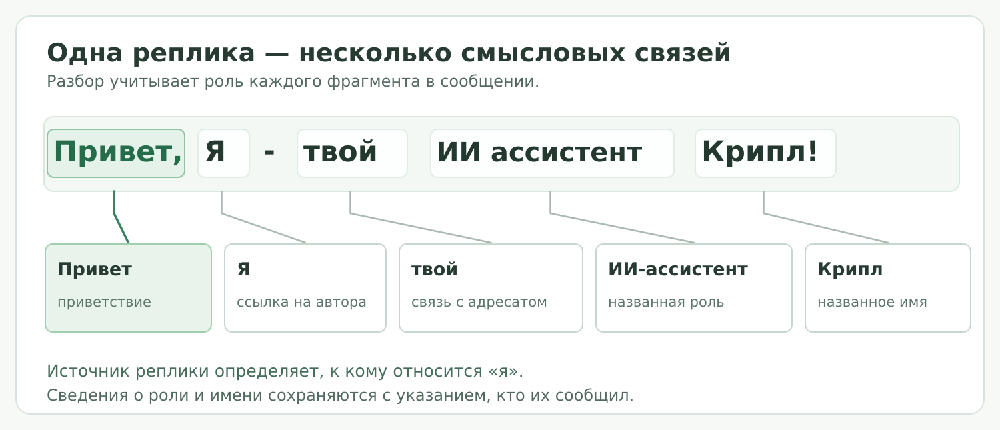
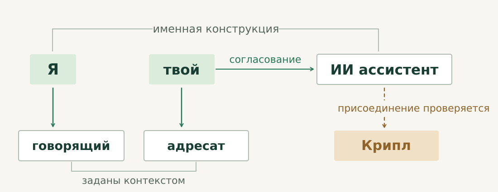
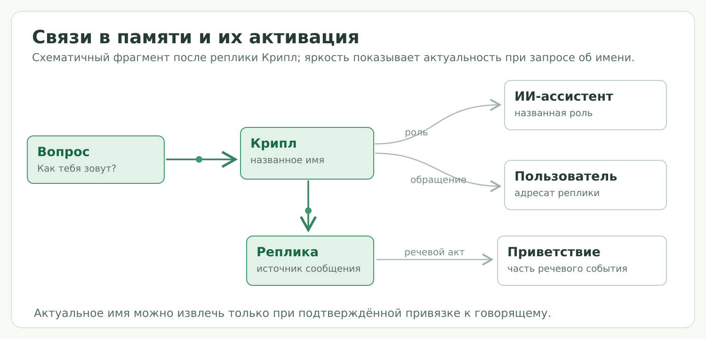

# AG Memory

**Ассоциативно-гетерархическая долговременная память для языковых агентов.**

AG Memory связывает содержание сообщений с участниками, отношениями и источниками. Формализатор строит смысловую структуру, память сохраняет её основания, ассоциативная активация определяет текущий фокус, а символический вывод проверяет следствия из доступных знаний.

[Текст и структура](#текст-и-структура) · [Значение](#разрешение-значения) · [Запись](#запись-в-память) · [Активация](#активация-и-ответ) · [Установка](#установка-и-встраивание)

---

## Текст и структура

> Привет, Я - твой ИИ ассистент Крипл!

Фраза рассматривается как утверждающий ввод формализатора. Говорящий и адресат явно заданы контекстом. Разбор следует нормативной архитектуре V7; показанные связи — кандидаты, допустимость которых определяется ресурсами. Это не результат запуска на конкретной модели.

### Исходные фрагменты · T0

Сохраняется точная строка: регистр, запятая, дефис, пробелы и восклицательный знак. Каждый токен получает диапазон в исходном тексте. Последующие решения ссылаются на эти диапазоны, поэтому происхождение связи можно проследить до конкретных слов.

`Я` занимает `[8, 9)`, `твой` — `[12, 16)`, `Крипл` — `[30, 35)`. Правая граница не входит в диапазон. Нормализация при разборе не изменяет сохранённую строку.

### Границы и лексические варианты · SRL

По токенам и объявленным правилам создаются варианты границ и частей предложения. Запятая позволяет проверить выделение начального «Привет»; остальной фрагмент рассматривается как кандидат именной конструкции. Разделение должно подтверждаться правилом.

У каждого слова сохраняется вариант **оставить исходную форму**. Отсутствующее в словаре «Крипл» остаётся доступным для дальнейшего разбора. Каждая предложенная замена требует собственного основания.

### Морфология и упоминания · T1

Морфологический ресурс возвращает леммы и грамматические варианты. Правила выделения упоминаний связывают слова в группы, сохраняя неоднозначные разборы.

| Фрагмент | Что передаётся дальше |
|---|---|
| **Я** | Местоимение первого лица, единственного числа. |
| **твой / ассистент** | Грамматические признаки для проверки согласования. |
| **ИИ ассистент** | Кандидат именной группы; раскрытие сокращения требует словарного основания. |
| **Крипл** | Исходная форма и доступные лексические варианты; функция имени ещё проверяется. |



### Зависимости и участники · TD

Строятся кандидаты зависимостей между упоминаниями. «Твой» присоединяется к именной группе по правилам согласования. Первое лицо в «я» позволяет обратиться к явно заданному говорящему; притяжательное местоимение требует установить адресата и связь с ним.

Получается кандидат группировки: **Я — [твой [ИИ ассистент] Крипл]**. Присоединение «Крипл» и привязки местоимений сохраняют свои основания. Неизвестный участник оставляет соответствующую ссылку нерешённой.

### Именная предикация · T2

Формируется **предикативная рамка**: содержание высказывания, его аргументы и допустимые роли. Для «я — ассистент» применяется предусмотренный V7 разбор именной конструкции с отсутствующей глагольной связкой.

В рамке выделяются тот, о ком говорится, и приписываемая ему характеристика. Связь с адресатом и присоединение «Крипл» уточняют эту структуру. Валентности задают допустимые аргументы; непостроенные связи передаются следующему этапу.

### Неполные связи · TP

Если правила не построили нужное присоединение, допускается локальная гипотеза. Так может уточняться связь «Крипл» с именной группой. Проверяются её опора на исходный текст, допустимые типы и совместимость с уже найденными признаками.

**LLM-парсер** предлагает структуру в пределах разрешённой задачи. Проверку выполняет формализатор. Предложение не назначает канонические идентификаторы и не записывает факт. При достаточном детерминированном разборе дополнительная гипотеза не нужна.

### Фиксация структуры · structural_seal

Фиксируются рамки, границы, зависимости и кандидаты ссылок. Сохраняются также оставшиеся пробелы. Дальнейший выбор значений выполняется внутри этой структуры; добавление новых связей потребует новой версии интерпретации по объявленному изменению входов.

## Разрешение значения

### Смысловые кандидаты · T3

Для позиций в рамке проверяются пять источников: значения схемы предиката и их объявленные расширения, словарь смыслов, сохранённые совместимые кандидаты, объявленный контекст и фоновое знание, открытое лексическое представление.

У «твой ИИ ассистент» требуется установить конкретный смысл отношения к адресату. У «Крипл» — значение в выбранной конструкции и связь именования. Найденное значение сохраняется вместе с источником; проверенный пустой результат также учитывается.

**Открытое лексическое представление** допускает сохранение нового предиката с ограниченными правами вывода. Оно требует разобранной структуры и не устраняет неопределённость участника или присоединения слова.

### Совместимость решений · T4

Согласуются значения, роли, грамматические варианты и ссылки на участников. Несовместимые сочетания отклоняются с указанием причины. Для однозначного исхода нужны завершённый поиск, один допустимый набор и положительное основание каждого выбранного значения.

| Состояние разбора | Исход |
|---|---|
| Говорящий, отношение к адресату и именование согласованы; поиск завершён. | `RESOLVED` — интерпретация определена. |
| Не задан участник, на которого ссылается местоимение. | `INSUFFICIENT_CONTEXT` — требуется контекст. |
| Сохранились несколько совместимых разборов, каждый с основаниями. | `AMBIGUOUS` — альтернативы остаются. |

Полный поиск без кандидатов даёт `NO_CANDIDATE`. Неполный поиск или другие препятствия сохраняются как `UNRESOLVED` с конкретной причиной. Все эти исходы относятся к интерпретации; решение о записи принимается далее.



### Сборка представления · assemble_candidate_ir

Структура, значения, решения, ограничения и исходные диапазоны собираются в единое неизменяемое представление. Для «Я», «твой» и «Крипл» сохраняется путь от текста до выбранной связи, включая отвергнутые варианты.

Следующий этап получает этот результат целиком. Неполнота остаётся явно обозначенной; сформированное представление ещё не является записью в АГ-памяти.

## Запись в память

### Каноническая привязка · C

Разрешённые локальные ссылки сопоставляются с существующими сущностями и шаблонами. Если говорящий и адресат уже представлены в памяти, план использует их канонические узлы. Связь имени с говорящим использует основания разрешённого именования.

Для известного смысла требуется действительное отображение на шаблон памяти. Для допустимого открытого предиката планируется изолированный шаблон. **На выходе C — план изменений:** какие элементы использовать, какие создать и как связать их с источником.

### Основания и журнал · T5

Проверяются завершённость решений, актуальность прочитанных данных, допустимость ролей и целостность ссылок. Утверждающая часть «Я — твой ИИ ассистент Крипл» может поддерживать своё разрешённое содержание как исходное наблюдение. Это прямая опора утверждения в памяти.

Морфологический разбор, сработавшее правило и выбор LLM-парсера объясняют интерпретацию. Поддержка самого факта требует исходного утверждения, явно заданного контекста либо фонового знания с происхождением.

Допущенный пакет фиксируется в журнале. Нерешённые участки остаются в журнале наблюдений без канонического факта; отдельно могут записываться только семантически независимые завершённые фрагменты.

### Узлы и гиперсвязи · T6

План применяется атомарно. Создаются или используются существующие языковые символы **S**, сущности **M**, шаблоны **T** и конкретные предикативные структуры **N**. Вместе с ними фиксируются основания и маркер состоявшейся записи.

**N связывает участников одного утверждения через роли шаблона T.** Так разрешённое отношение ассистента к адресату становится частью гиперграфа. Другие утверждения могут ссылаться на тех же участников. Состав узлов и ролей определяется выбранной схемой.

Имя «Крипл» получает каноническую связь только после разрешения именования. «Привет» сохраняется в исходной реплике; отдельная семантическая запись требует объявленного ресурса. Знаки препинания сами по себе не создают логических операторов.

### Пересмотр · T6b

Изменение источника, объявленного контекста или используемого ресурса создаёт новую версию интерпретации. Пересчитываются только затронутые зависимости и отзываются устаревшие опоры.

Если исправлена привязка «я», пересматриваются утверждения, опиравшиеся на неё. Независимые основания сохраняют действие. Исходный текст, прежние решения и история отзыва остаются доступны. Повтор неизменённого входа не создаёт новую версию.

## Активация и ответ

### Распространение возбуждения

После записи входной стимул активирует связанные элементы памяти. Возбуждение передаётся по связям, изменяя текущую актуальность узлов. Элементы, преодолевшие свой порог активации, входят в **рабочее пространство**.

При вопросе **«Кто мой ассистент?»** актуальными могут стать адресат, сохранённое отношение и его участник. Высокая активация влияет на доступность для обработки; действительность утверждения определяется живыми основаниями.



*Показано ядро возможного сохранённого отношения. Именование и остальные связи опущены; степень возбуждения условна.*

### Вспоминание и цель запроса

Вспоминание предоставляет актуальные структуры. Запрос отдельно преобразуется в цель: после разрешения «мой» требуется найти участника отношения с данным адресатом. Цель обращается к доступным узлам и проверяет их основания. Для этого вопроса достаточно извлечения сохранённой связи; логическое следствие строится, когда его требует цель.

Имя **Крипл** включается в ответ при действующей связи именования. Отсутствие нужной опоры сохраняет неизвестность. Сам вопрос не становится утверждением о мире; допустимые производные результаты записываются отдельным контуром исполнения целей.

### Контекст агентской модели

Из доступных сведений и результатов вывода собирается контекст **агентской LLM**. Она формулирует ответ. Сгенерированный текст сохраняется в истории опыта через отдельный путь интеграции; сама генерация не предоставляет канонической записи основание истинности.

LLM-парсер участвует в локальных решениях формализатора, агентская LLM — в формировании ответа. Одну физическую модель можно использовать в обеих ролях с разными входами и полномочиями.

---

## Документация

[Формализатор V7](docs/FORMALIZER_ARCHITECTURE_V7.md) — нормативные стадии, ресурсы, основания и запись. [Архитектура АГ-памяти](docs/reference/Архитектура_v3.md) — гиперграф, активация и цикл агента. [Карта реализации](docs/IMPLEMENTATION_MAP_V7.md) — связь компонентов с исходным кодом.

## Установка и встраивание

Требуются **Python 3.12+**, **uv** и подключённая языковая модель.

```bash
git clone --branch temp https://github.com/MaxSquizie/AG_Memory.git
cd AG_Memory
uv venv
uv pip install -e ".[gui]"
```

После настройки модели и согласованных ресурсов формализатора:

```bash
uv run ah-gui --config config/ollama.toml
```

Для V7 необходимы проверенный ресурсный релиз и канонические шаблоны, соответствующие его ссылкам. Параметры запуска приведены в [RUN.md](docs/RUN.md), требования к ресурсам — в [архитектуре V7](docs/FORMALIZER_ARCHITECTURE_V7.md).

Точки встраивания расположены в `src/ah/`; назначение компонентов приведено в [карте реализации](docs/IMPLEMENTATION_MAP_V7.md).
